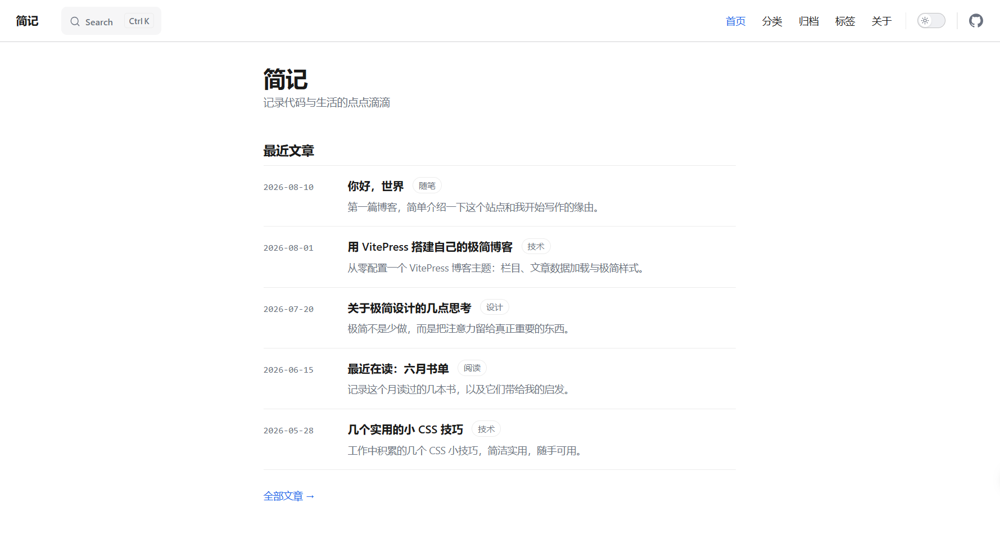

# VitePress 极简博客主题



[English](./README.md) | 简体中文

一套面向 [VitePress](https://vitepress.dev) 的极简、内容优先的博客主题/模板。纯白画布、大量留白、克制的点缀色 —— 为希望让文字呼吸的写作者而生。

> 本仓库是**模板仓库**：clone 或 fork 之后，把文章扔进 `posts/`，改几处配置，就是一个属于你自己的博客。无需额外 `npm install` 主题包。

## 特性

- 📝 **Markdown 优先写作** —— frontmatter 含 `title`、`date`、`category`、`tags`、`description`；正文里的 `<!-- more -->` 用于截断卡片摘要。
- 🏠 **五个内置页面** —— 首页（最近文章）、分类、归档、标签、关于。
- 🎨 **极简视觉语言** —— 无侧栏干扰、单栏阅读、顶部阅读进度条、文章标题上方轻量元信息行（`日期 · 分类 · 标签`）。
- 🔍 **本地搜索** 开箱即用（VitePress 内置）。
- 🧭 每篇文章底部按日期显示**上一篇 / 下一篇**。
- 🛠 **`pnpm new:post` 命令行工具** —— 交互式或非交互式新建文章，支持中文友好的 slug 生成。
- 📄 **类型化数据加载器** —— `posts.data.ts` 向所有组件暴露强类型的 `Post[]`。
- ⚡ **VitePress + Vue 3 + TypeScript** —— 现代、快速、可扩展。

## 技术栈

| 层级      | 选型                |
| --------- | ------------------- |
| 静态生成  | VitePress ^1.6      |
| UI        | Vue 3.5 (SFC)       |
| 语言      | TypeScript          |
| 包管理    | pnpm 11 (corepack)  |

## 快速开始

```bash
# 1. 克隆（或使用 GitHub 的 "Use this template" 按钮）
git clone https://github.com/<you>/theme-dev.git my-blog
cd my-blog

# 2. 安装依赖
pnpm install

# 3. 启动开发服务器
pnpm dev
```

打开 http://localhost:5173 开始编辑。

## 项目结构

```
theme-dev/
├── .vitepress/
│   ├── config.mts            # 站点配置（标题、导航、搜索…）
│   └── theme/
│       ├── components/        # 博客页面与组件
│       ├── Layout.vue         # 布局胶水（注入 DefaultTheme.Layout 槽位）
│       ├── posts.data.ts      # 类型化内容加载器
│       ├── style.css          # 全局样式与设计变量
│       ├── utils.ts           # slugify / formatDate 工具函数
│       └── index.ts           # 主题入口
├── pages/                     # 非文章路由（about、archives、category、tags、home）
├── posts/                     # 你的博客文章（Markdown）
├── public/                    # 静态资源（favicon…）
├── scripts/
│   ├── templates/post.md      # `new:post` 默认正文模板
│   └── new-post.mjs           # 新建文章脚手架 CLI
└── package.json
```

## 写一篇文章

### 交互式

```bash
pnpm new:post
# 会依次提问：标题、分类、标签、摘要
```

### 非交互式

```bash
pnpm new:post "我的新文章" \
  --category 技术 \
  --tags "Vue,CSS" \
  --description "一段简短摘要" \
  --slug my-post \
  --date 2026-08-19
```

生成的文件位于 `posts/<slug>.md`。Frontmatter 结构：

```yaml
---
title: 我的新文章
date: 2026-08-19
category: 技术
tags:
  - Vue
  - CSS
description: 一段简短摘要
---
```

在正文中插入 `<!-- more -->` —— 其上方的部分会成为首页 / 分类 / 标签页卡片上的摘要。

## 配置

站点级配置全部在 [.vitepress/config.mts](./.vitepress/config.mts) 里，改顶部两个常量即可：

```ts
const siteTitle = '你的站点名'
const siteDescription = '你的站点描述'
```

下面的 `themeConfig` 里有导航、版权、目录标签等，按需替换。完整 API 见 [VitePress 配置参考](https://vitepress.dev/reference/site-config)。

## 脚本

| 脚本               | 说明                                      |
| ------------------ | ----------------------------------------- |
| `pnpm dev`         | 启动开发服务器（含 HMR）                  |
| `pnpm build`       | 构建静态站点到 `.vitepress/dist`          |
| `pnpm preview`     | 本地预览构建产物                          |
| `pnpm new:post`    | 新建文章（交互式或命令行参数）            |
| `pnpm theme:sync`  | 从上游模板仓库拉取最新主题文件           |

### `pnpm theme:sync` —— 同步主题更新

通过 [`@yakad/sync`](https://www.npmjs.com/package/@yakad/sync) 克隆（或更新）上游模板仓库 [`lorlike/vitepress-theme-minimalism`](https://github.com/lorlike/vitepress-theme-minimalism)，并把其中的文件复制到你的项目中，让你的 fork 能拿到主题 / 布局 / 组件的修复，同时不丢失你自己的内容。

[.syncignore](./.syncignore) 中列出的文件和目录在复制时会被跳过，保护你的文章与配置不被覆盖：

```
posts/                       # 你的文章
.vitepress/config.mts       # 你的站点配置
.github/workflows/          # 你的 CI
.syncignore                  # 本文件自身
```

默认开启详细输出（`-v`），每个被复制的文件都会打印出来。要保护更多路径，往 `.syncignore` 追加即可（语法同 `.gitignore`）。

## 部署

VitePress 输出静态文件到 `.vitepress/dist`，推到仓库后接入任一平台即可：

- **GitHub Pages** —— 见 [VitePress 部署指南](https://vitepress.dev/guide/deploy#github-pages)
- **Netlify / Vercel / Cloudflare Pages** —— 构建命令 `pnpm build`，输出目录 `.vitepress/dist`

## 参与贡献

欢迎提 Issue 和 PR。在提交 Pull Request 之前请先阅读 [CONTRIBUTING.md](./CONTRIBUTING.md)。

## 许可证

[MIT](./LICENSE) © Lorlike
